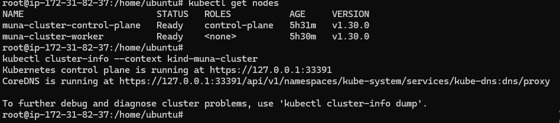
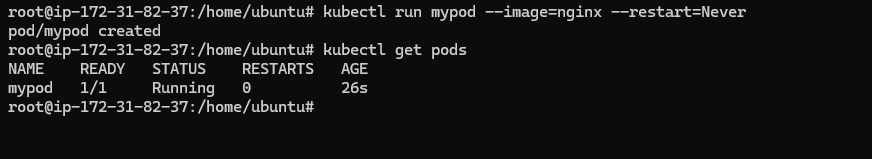
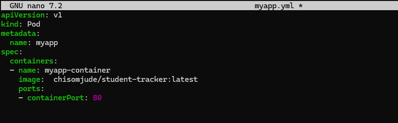
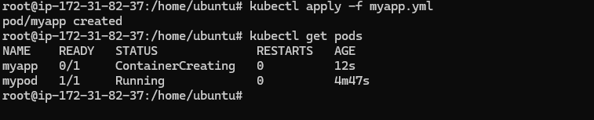

# Kubernetes - Setup and Basics for NativeSeries

In this phase we are going to set up kubernetes using kind. Kind is the 

### Prerequisites

- ensure Docker is installed and runnning on your machine
- ensure your VM has enough space 16-20gb prefereably check using `df -h`


```
#Update System

sudo apt update && sudo apt upgrade -y
sudo apt install -y curl apt-transport-https ca-certificates gnupg lsb-release


 #Install kubectl
curl -LO "https://dl.k8s.io/release/$(curl -Ls https://dl.k8s.io/release/stable.txt)/bin/linux/amd64/kubectl"
chmod +x kubectl
sudo mv kubectl /usr/local/bin/

# Install kind
curl -Lo ./kind https://kind.sigs.k8s.io/dl/latest/kind-linux-amd64
chmod +x ./kind
sudo mv ./kind /usr/local/bin/kind

```
## Create Your cluster
Create a file named `kind-config.yaml` with the following:

```
kind: Cluster
apiVersion: kind.x-k8s.io/v1alpha4
nodes:
  - role: control-plane
    extraPortMappings:
      - containerPort: 80
        hostPort: 80
        protocol: TCP
      - containerPort: 443
        hostPort: 443
        protocol: TCP
  - role: worker
  
```


```
kind create cluster --name <your-clustername> --config kind-config.yaml --image kindest/node:v1.30.0

#Example
kind create cluster --name muna-cluster --config kind-config.yaml --image kindest/node:v1.30.0

```


### Create your first pod using imperative command
```
kubectl run mypod --image=nginx --restart=Never
```


### Deploy your app as a pod, using your image 

image in k8s yaml file can be referenced as

```yaml
image: your-dockerhub-username/your-image-name:tag
```

Create a Pod YAML File called myapp.yaml and enter this

```yml
apiVersion: v1
kind: Pod
metadata:
  name: myapp
spec:
  containers:
  - name: myapp-container
    image: your-dockerhub-username/your-image-name:tag
    ports:
    - containerPort: 80
```


Apply the file ---> `kubectl apply -f myapp.yaml`





### Other usefull Command

```bash
kind delete cluster --name <your-clustername>
kubectl cluster-info --context kind-<your-clustername>

kubectl get pods
kubectl describe pod podname
kubectl logs <podname>
```

