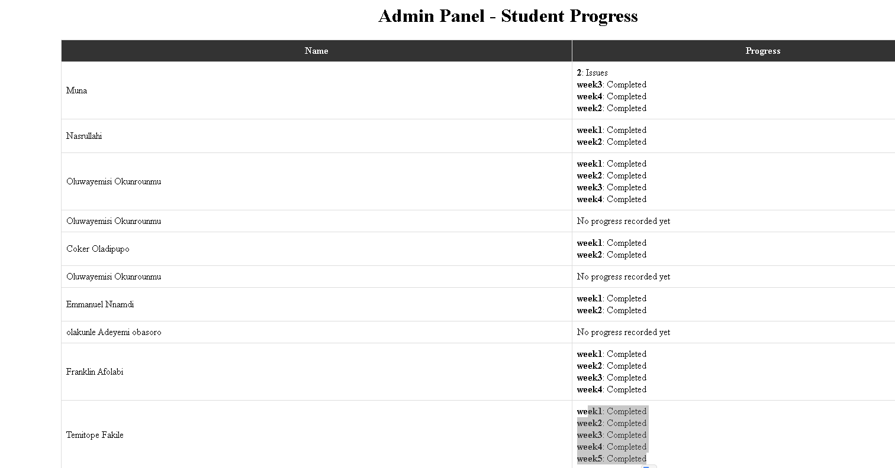

# CICD with Gitactions to AWS EC2
To proceed with week 6 , you will Roleplay as the  `Engineer` for our Python app NativeSeries Student Project Tracker APP and the `Devops`

## Devops: 

- Download the App - Click [the NativeSeries Repo](https://github.com/bonaventuresimeon/NativeSeries), recreate your own repo with the same content on your github account
- Optional  run it locally to be sure it works, rememeber to export vault cred. 

- Write your cicd workflow using git action that deploys this app to your EC2 given (see docs shared in Class). Update the Readme with anything and commit to trigger your cicd or test deployment 

- Check successfull deployment. <http://yourVMIP:port> 

- Ensure your port is added to the security group of the EC2

## RolePlay -  Engineer 
- Update your repo, create your own repo with the same content
- Add `admin.html` in `templates folder`  see repo 2 [Click here](https://github.com/ChisomJude/student-progress-tracker2)

- Update `app/crud.py` - see commented parts in repo
- update  `app/main.py` - see see commented parts 

- on commit and push, this change should trigger your workflow to deployment admin side
<http://yourVMIP:port/admin> 

## You made it here - Admin Side
Update your progress  as usual for week 6

