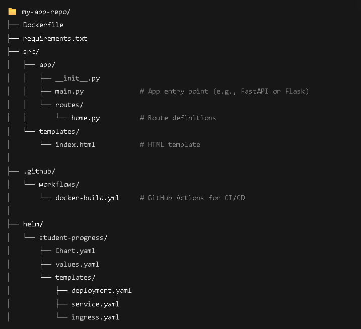

# Git Ops with ArgoCD for NativeSeries
We will be diving deeper with cloud native deployment using a single source of truth

### Div in to this Week Handson:
- cluster ready
- install Argocd and access the ui ( [follow argocd doc for guide](https://argo-cd.readthedocs.io/en/stable/))
- prepare your project repo  see image below
- set up ci using gitactions to build and push your image to dockerhub
- configure helm chart for app deployment

#### Your repo should look like this

### Your Workflow 
- Step 1: Code Changes 

  - You write code or modify and push it to GitHub, this kickstarts the automation. 

- Step 2–3: Build and Push Docker Image 

    - GitHub Actions runs automated tasks. 
    - It builds a Docker image and pushes it to DockerHub  

- Step 4: Update Kubernetes Manifests 
  - You have Kubernetes YAML files in Git. 
  - Once the Docker image is ready, the YAML gets updated with the new image tag/version. 

- Step 5: ArgoCD Detects the Change 

  - ArgoCD continuously monitors the Git repo. 
  - It notices the updated manifest and gets ready to deploy. 

- Step 6: ArgoCD Syncs to Cluster 

  - ArgoCD “syncs” your Git-defined desired state with your cluster (Kind). 

  - It applies the new manifest and updates the app. 

 - Step 7: App Is Running! 

   - Your app is now live and running in the Kubernetes cluster and controled from github via argocd 

  - You can test a rollback (optional) using git  revert or argocd ui or even change your image version on your values.yml file 

